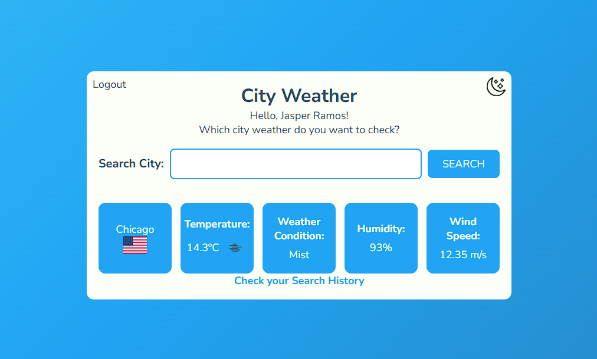
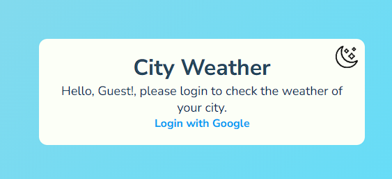
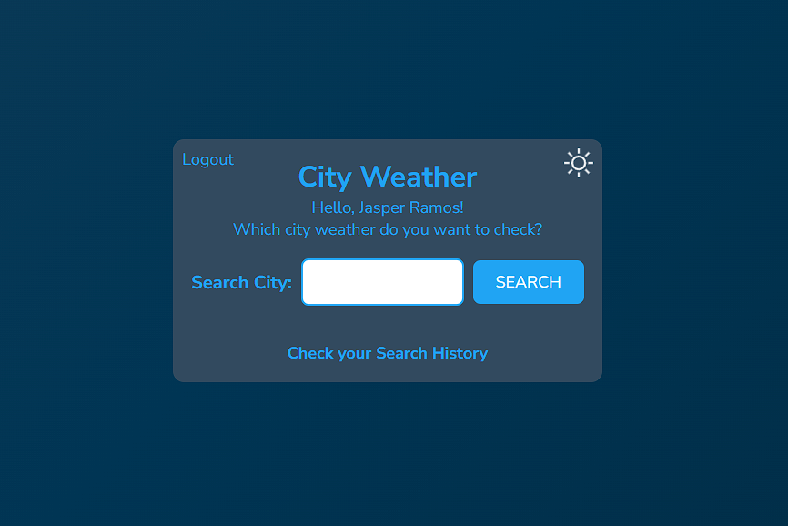
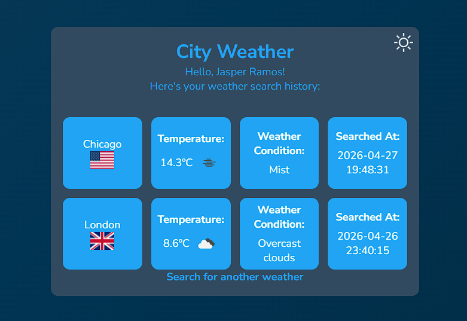

# City Weather Dashboard



> A Jinja2 Python city weather dashboard that fetches real-time data from OpenWeatherMap API. User needs to login using OAuth from Google, then searches the weather, the weather is saved and can be shown in the user weather search history.

https://weather-dashboard-ten-sandy.vercel.app/

## ⚙️ Project Structure

```bash
weather-dashboard/
├── docs/                  # Screenshots and documentation images
├── static/                # CSS, JS and image assets
├── templates/             # HTML templates (Jinja2)
├── .env.example           # Environment variables template
├── .gitignore
├── app.py                 # Flask application and routes
├── main.py                # OpenWeatherMap API logic
├── requirements.txt       # Python dependencies
├── vercel.json            # Vercel deployment configuration
└── README.md
```

## 🔧 Used Tools

> [!IMPORTANT]
> - Python (Python 3.11 was the used in this project)
> - Flask
> - SQLAlchemy
> - PostgreSQL (Supabase)
> - Google OAuth (Authlib)
> - OpenWeatherMap API

## 🕹️ Features

Google OAuth

> The user can only search weathers if he's logged and authorized through Google Auth


> We also added a feature so the user can enable night mode, both modes design look like the container is a cloud, the gradient animated background should give this vibe too.


> Every user can check their weather search history and the time and date they searched, using SQLAlchemy and Postgre from Supabase, we create tables to each search made by each user.

## 🍴 How to Run Locally

- First thing you've got to do is fork the project to use on your own repository, this way you can change the project the way you want
- After forking and cloning, you open the project in your terminal and create a virtual environment (venv)
- Run venv
Commonly used command in terminal:

```bash
venv/scripts/activate
```

- You'll need to use a few dependencies in order for the project to work correctely, you can use the command below

```bash
pip install flask flask-sqlalchemy authlib python-dotenv requests psycopg2-binary
```

- Then you'll edit .env .example (remove .example) with your environment variables
- After everything is set-up, you go back to your terminal and run the command:

```bash
python app.py
```

- The project now should be working fine through [localhost:5000](http://localhost:5000/) or [1](http://127.0.0.1:5000/)

## 📓 Environment Variables

This is the list of Environment Variables you need (You can check it out in .env . example):

```bash
API_KEY=your_api_key_here (You get this from OpenWeather API)
GOOGLE_CLIENT_ID=your_client_id_here (From Google Cloud Console)
GOOGLE_CLIENT_SECRET=your_client_secret_here (From Google Cloud Console)
SECRET_KEY=your_secret_key_here (This is a random string you should generate to make it safer)
USER=your_postgres_user (From SUPABASE)
PASSWORD=your_postgres_password (From SUPABASE)
HOST=your_postgres_host (From SUPABASE)
PORT=your_postgres_port (From SUPABASE)
DBNAME=postgres 
```

## ✅ Future Intended Updates

- [ ] Multilingual Support
- [ ] Drop Down Menu Suggesting Cities

## ⚖️ License

MIT License.